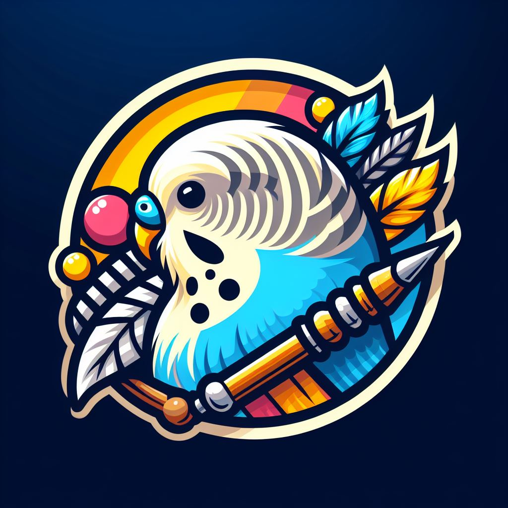

<!-- PROJECT LOGO -->
 

  

  <h3 align="center">Birds of a Feather</h3>

<!-- TABLE OF CONTENTS -->

  
Table of Contents

  <ol>
    <li>
      <a href="#about-the-project">About The Project</a>
      <ul>
        <li><a href="#built-with">Built With</a></li>
      </ul>
    </li>
    <li><a href="#getting-started">Getting Started</a></li>
    <li><a href="#usage">Usage</a></li>
    <li><a href="#contact">Contact</a></li>
    <li><a href="#acknowledgments">Acknowledgments</a></li>
  </ol>

<!-- ABOUT THE PROJECT -->

## About The Project

[![Product Name Screen Shot][product-screenshot]](https://example.com)

**Note:** This README specifically pertains to the frontend of the project. Enclosed in this repository is the source code for the Birds of a Feather forum's frontend. Crafted for the CVWO summer project, it signifies the culmination of approximately two months of delving into web development, starting from ground zero and evolving continuously since the end of last semester's exams.

**Forum Theme:** The central theme of the forum revolves around birds as I own two budgerigars, and I love birds! The forum is called "Birds of a Feather" as birds of a feather flock together.

I hope you enjoy this website!

(<a href="#readme-top">back to top</a>)

### Built With

The frontend of this project leverages a robust stack of technologies and frameworks to deliver a modern and responsive web application. Here's a detailed overview of the key components:

- **React**: A dynamic JavaScript library for building interactive user interfaces, providing a seamless user experience.

- **TypeScript**: Enhancing code quality and development efficiency through static typing, TypeScript ensures a more robust and maintainable codebase.

- **Vite**: A fast and efficient build tool that facilitates quick and optimized development and production builds.

- **Shadcn UI**: Styling is powered by the Shadcn UI library, contributing to a visually appealing and cohesive design across the application.

- **React Router**: Ensuring smooth navigation and seamless routing within the application for an intuitive user journey.

- **React Query**: Efficient state management that simplifies data fetching, caching, and updates, contributing to a responsive and interactive user interface.

- **Recharts**: To display statistics in a clean and responsive manner.

- **React Hot Toasts**: Implemented for real-time notifications, providing users with instant feedback and enhancing overall interactivity.

- **Docker**: Employing Docker for containerization, simplifying deployment and ensuring consistent performance across various environments.

The feature set includes fundamental CRUD operations for data manipulation, as well as advanced functionalities such as filtering, sorting, searching, pagination, optimistic updates and account-based authentication using JWT tokens.

- [![React][React.js]][React-url]

(<a href="#readme-top">back to top</a>)

<!-- GETTING STARTED -->

## Getting Started

Both the frontend and backend are hosted on Digital Ocean. You can access the frontend using the following link:

[**Birds of a Feather Frontend**](https://birds-of-a-feather-c5xki.ondigitalocean.app)

For additional usage instructions, refer to the details provided in the Usage section below.

(<a href="#readme-top">back to top</a>)

<!-- USAGE EXAMPLES -->

## Usage

1. **Logging in and Signing up:**

   - Upon entering the application, you'll be redirected to the login page.
   - Use the default login details (email: example@example.com, password: password) or sign up by clicking on the sign up tab.

2. **Joining a Community:**

   - Navigate to the communities via the left sidebar.
   - Click on a community to visit its homepage.
   - Join a community by clicking the "Join" button in the community header.

3. **Creating a Post:**

   - Join a community first (if not done already).
   - Click "Create Post" in the community header.
   - Fill in the required information to create a post.

4. **Creating a Community:**

   - Access the communities via the left sidebar.
   - Click "Create Community" on the right side of the application.

5. **Replying:**

   - Find the "Reply" button at the bottom right of each post card.
   - Click to reply to a post.

6. **Upvote/Downvote:**

   - Use the upvote/downvote buttons at the bottom right of each post card.

7. **Following and Unfollowing:**

   - Navigate to the Friends page via the left sidebar.
   - Manage followers on the left and potential follows on the right.
   - Click "Follow" or "Unfollow" accordingly.

8. **Update Account Details:**

   - Click on the user icon (top right) to visit the user homepage.
   - Use the "Update Account" button in the user header.

9. **Miscellaneous:**
   - Toggle dark mode/light mode using the middle button on the top right.
   - Filter/sort the posts by using the Filter and sort buttons on the top right of the application just below the header.
   - Search for posts using the search bar on the top of the application
   - Sign out using the sign out button on the top right of the application

(<a href="#readme-top">back to top</a>)

<!-- CONTACT -->

## Contact

- **Telegram**: @benjaminwjy
- **Email**: ben.wang9000@gmail.com

Project Link: [https://github.com/your_username/repo_name](https://github.com/your_username/repo_name)

Website link: [**Birds of a Feather Frontend**](https://birds-of-a-feather-c5xki.ondigitalocean.app)

(<a href="#readme-top">back to top</a>)

<!-- ACKNOWLEDGMENTS -->

## Acknowledgments

Use this space to list resources you find helpful and would like to give credit to. I've included a few of my favorites to kick things off!

- [React Icons](https://react-icons.github.io/react-icons/search)

(<a href="#readme-top">back to top</a>)

